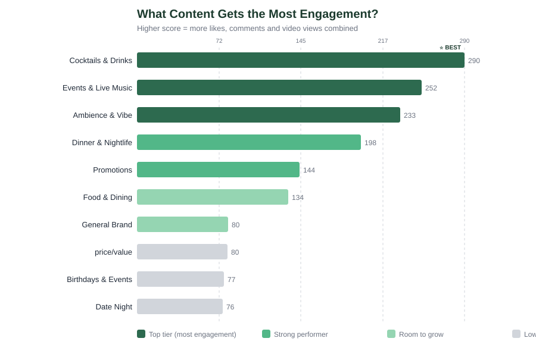
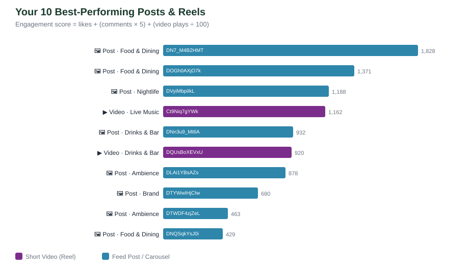
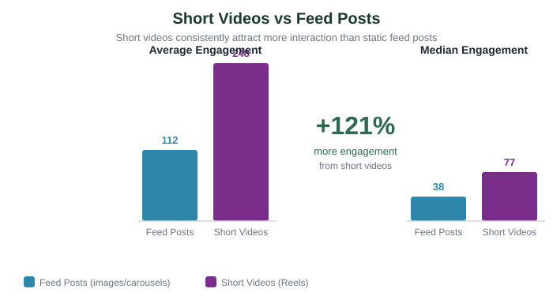
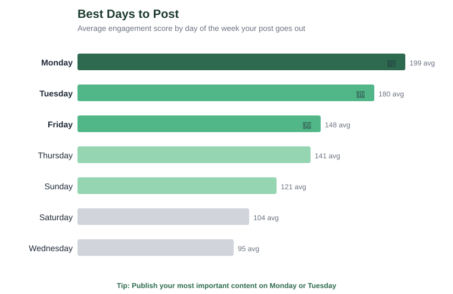
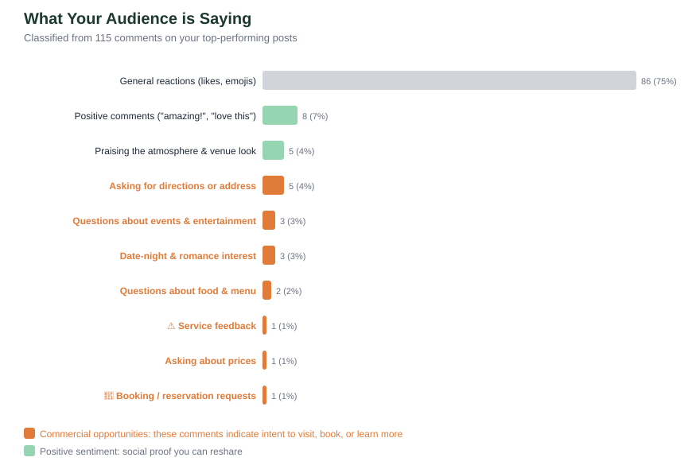
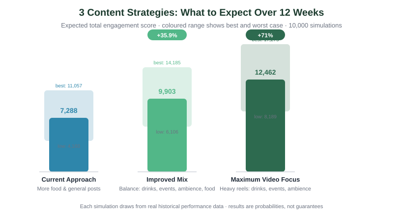

# Treehouse Ghana — Instagram Performance Report
*Prepared 2026-05-31 · Based on 135 posts, 84 reels, 21 external mentions and 106 audience comments*

---

## At a Glance

| | |
|---|---|
| 👥 **Followers** | **27,386** at time of analysis |
| 📊 **Posts analysed** | 135 feed posts + 84 short videos |
| 🏆 **Best-performing content type** | Cocktails & Drinks (avg score 290) |
| 📅 **Best day to post** | **Monday** (avg score 199) |
| 🎬 **Posts vs short videos** | Short videos attract more engagement on average — worth expanding |

> **What this means in plain English:** This account has a healthy, active following. Its strongest content is **cocktails & drinks**. The biggest opportunity is posting more Cocktails & Drinks, Events & Live Music, Ambience & Vibe content with clear calls to action.

---

## What Content Works Best

The chart below shows how different types of content perform. The longer the bar, the more engagement it attracts.

### Key takeaways
🥇 **Cocktails & Drinks** — avg score **290** (11 posts): about 128% above your typical post — a proven strength to do more of.
🥈 **Events & Live Music** — avg score **252** (8 posts): only 8 posts so far — a promising signal worth testing with more.
🥉 **Ambience & Vibe** — avg score **233** (15 posts): about 84% above your typical post — a proven strength to do more of.
4️⃣ **Dinner & Nightlife** — avg score **198** (17 posts): about 56% above your typical post — a proven strength to do more of.
5️⃣ **Promotions** — avg score **144** (2 posts): only 2 posts so far — a promising signal worth testing with more.

---

## Your 10 Best-Performing Posts

These posts and videos are your proven best-sellers. Study what made them work:
- What topic was it about?
- Was there a clear call to action ("book now", "come tonight")?
- Did it feature video or just a still image?

---

## Posts vs Short Videos

**Why this matters:** Short videos (Reels) reach people beyond your existing followers through Instagram's discovery feed, and here they attract more engagement on average than feed posts. Expanding short-video output is a strong opportunity.

> **Practical tip:** You don't need expensive equipment. A smartphone held still for 15–30 seconds of a dish being plated or an event being set up is enough to test the format.

---

## Best Days and Times to Post

| Day | Average Engagement | Recommendation |
|---|---|---|
| **Monday** | 199 | ✅ Best day — post your most important content here |
| **Tuesday** | 180 | ✅ Second-best — strong engagement |
| **Friday** | 148 | 🟡 Good — solid performance |
| **Thursday** | 141 | 🟡 Good — solid performance |
| **Sunday** | 121 | ⚪ Lower priority |
| **Saturday** | 104 | ⚪ Lower priority |
| **Wednesday** | 95 | ⚪ Lower priority |

---

## What Your Audience Is Saying

The comments on your top posts reveal exactly what people want to know. We analysed **106 comments** and grouped them by topic.

### Commercial opportunities hiding in your comments

Most comments are light praise — lovely, but not where business comes from. The value is in the smaller, specific categories below: people effectively raising their hand. These are your actual comment types, ranked by how often they appear, with the move each one calls for:

| Comment type (and how often) | What to do about it |
|---|---|
| **location/access question** (5, 4.7%) | Logistics questions. Pin the address, date or ticket link in captions and a "Find Us / Events" Highlight so the answer is always one tap away. |
| **event interest** (3, 2.8%) | Logistics questions. Pin the address, date or ticket link in captions and a "Find Us / Events" Highlight so the answer is always one tap away. |
| **date-night/romantic ambience** (3, 2.8%) | People are drawn to the look and feel, not a specific question. Lead with this in your visuals, reshare the strongest examples as social proof, and pair the aspiration with one concrete next step (visit / book / watch). |
| **menu/food curiosity** (2, 1.9%) | Product/price curiosity. Answer it proactively with a monthly menu/price carousel and a pinned FAQ, so buyers don't have to ask. |
| **service issue/complaint** (1, 0.9%) | Operational feedback. Route these to a person, respond fast and privately, and track resolution time — visible unanswered complaints cost trust. |

---

## Three Paths Forward

We simulated three content approaches by drawing on your past performance. Each was run 10,000 times to show a likely range.

| Approach | Expected 12-Week Total | Compared to Now |
|---|---|---|
| **Current approach** | ~7,288 | Baseline |
| **Improved mix** (lean into your top categories) | ~9,903 | +35.9% |
| **Heavier video** (more short-form) | ~12,462 | +71% |

> These numbers are estimates based on past performance — your results will vary with creative quality, timing and trends.

---

## Recommended Actions

Take these steps in order. Each one builds on the last, and every one is drawn from what your own data shows above.

### This week (quick wins)
1. **Reply to every high-intent comment within 30 minutes during posting hours.** Your most common commercial signal is *location/access question* (4.7% of comments) — those are warm leads, and a fast reply is what converts them.
2. **Make the one next step you most want frictionless in your bio.** Whatever action your top comments are asking for, put a single tap to it (link, form, or saved reply) at the top of your profile so nobody has to hunt for it.
3. **Pin a Highlight that answers your most-asked question.** Build it around the comment type above so the answer is always one tap away instead of being re-typed in DMs.

### This month
4. **Publish more of what already works.** Your strongest category is **Cocktails & Drinks**. Schedule more of it deliberately rather than leaving your best content to chance.
5. **Post on your strongest day.** Engagement peaks around **Monday** — anchor your most important posts there.
6. **Reshare your best social proof.** Take two of your strongest mentions or comments, reshare them, and end the caption with one explicit next step.

### This quarter
7. **Rebalance your calendar toward the "Improved mix" above** (the simulated path worth roughly +35.9% over 12 weeks): more of your top categories, fewer low-engagement generic posts.
8. **Set and assign a comment response-time target** (30 minutes in working hours) so high-intent comments are never missed.
9. **Track one metric monthly** — average engagement score per content type — and ask us to re-run this analysis in 90 days to measure progress against this baseline.

---

## Glossary — plain-English definitions

A few terms appear above. Here is what each one means, in everyday language:

| Term | What it means |
|---|---|
| **Engagement score** | A single number combining likes, comments and video plays, so different posts can be compared fairly. Higher means more people interacted. The exact formula is *likes + (comments × 5) + (video plays ÷ 100)*; comments count for more because they take more effort than a like. |
| **Reel / short video** | Instagram's short vertical video format. Reels are pushed to people who don't follow you yet, so they are the main way to reach new audiences. |
| **Feed post / carousel** | A standard image or multi-image ("carousel") post that appears on your grid. Mostly seen by people who already follow you. |
| **Content category (pillar)** | A theme we grouped your posts into (for example, behind-the-scenes, projects, events) so we can see which themes earn the most engagement. |
| **Comment intent** | What a commenter actually wants — praise, a question, a booking/collaboration request — rather than just the words. High-intent comments are warm leads. |
| **Warm lead** | Someone who has signalled real interest (a question or request) and is far more likely to convert into a customer or collaborator than a passive viewer. |
| **Simulation (Monte Carlo)** | We re-played your likely results thousands of times using your own past performance, to show a *range* of outcomes rather than a single guess. |
| **Likely range** | The band most outcomes fell into across those simulations — a realistic best-to-worst spread, not a promise. |
| **Baseline** | Your current performance, used as the reference point everything else is compared against. |
| **CTA (call to action)** | The one specific next step you ask the audience to take in a caption — "book here", "watch now", "send your reel". |
| **Highlight** | The saved, pinned story circles under your bio. They stay permanently, so they are ideal for answers people ask for repeatedly. |

---

## About This Report

This report is based entirely on **public** Instagram data — posts, reels, comments and mentions visible to anyone. It does not use your private Instagram analytics (reach, impressions, saves, shares, profile visits). For a complete picture, combine these findings with your native Instagram Insights.

*Analysis by: data pipeline in this repository. Charts and numbers update automatically when the analysis is re-run. Last generated: 2026-05-31.*
