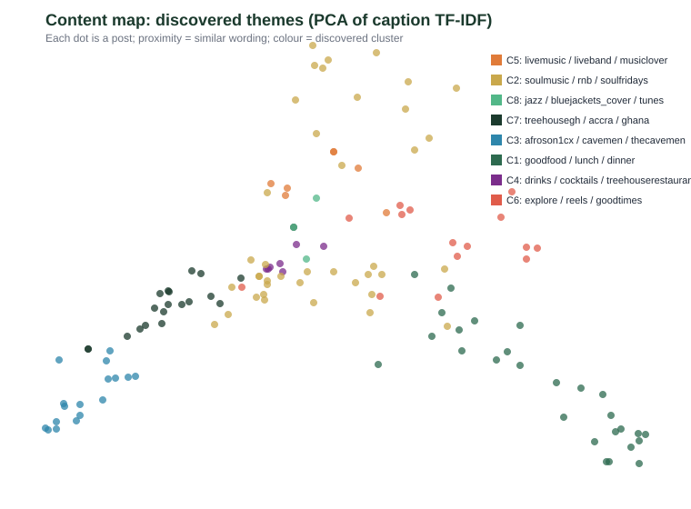

# Treehouse Ghana: Data-Driven Content Structure
*Unsupervised discovery · 136 posts · seed 20260530 · fully reproducible*

---

## What this is

Instead of sorting posts into categories we chose in advance, this analysis lets the **data choose the categories**. Every post's caption, hashtags and mentions are turned into a numeric "fingerprint" (TF-IDF), and an unsupervised algorithm (**k-means clustering**, with the number of groups chosen automatically by silhouette score) groups posts that use similar language. A PCA projection then places every post on a 2-D map so similar posts sit close together.

This is interpretable machine learning, chosen deliberately over a black-box neural network: at this data scale it is **reproducible** (fixed seed → identical result every run) and every grouping can be inspected and explained. It is exploratory: it surfaces hypotheses about how the content naturally organises, which the keyword pillars in the main report cannot.

> **Method honesty.** The clusters were selected at k=8 with a mean silhouette of **0.082**, i.e. separation is weak (themes overlap heavily; treat clusters as soft, indicative groupings rather than hard segments). The value here is not crisp segmentation but the **engagement pattern across themes** below, which is clear and actionable.

---

## The themes the data revealed

Ordered by average engagement (highest first):

| Theme | Posts | Avg engagement | Defining words (auto-extracted) |
|---|---|---:|---|
| 1 | 7 (5.1%) | **246** | livemusic, liveband, musiclover, tuesday, live, every, music, reels |
| 2 | 40 (29.4%) | **189** | soulmusic, rnb, soulfridays, goodvibesonly, soul, friday, soulfriday, dinner |
| 3 | 3 (2.2%) | **168** | jazz, bluejackets_cover, tunes, 7pm, thursday, restaurant, delicious, join |
| 4 | 20 (14.7%) | **143** | treehousegh, accra, ghana, fashion, entertainment, tickets, december, weekgh |
| 5 | 17 (12.5%) | **128** | afroson1cx, cavemen, thecavemen, malaikurd, afx2026, mx24gh, mxbreaks, accra2026 |
| 6 | 27 (19.9%) | **87** | goodfood, lunch, dinner, treehouserestaurant, foodie, foodinsta, food, call |
| 7 | 7 (5.1%) | **83** | drinks, cocktails, treehouserestaurant, friends, friday, together, valentine, sweet |
| 8 | 15 (11%) | **51** | explore, reels, goodtimes, foodlover, dinner, treehouserestaurant, food, perfection |

---

## What stands out

- **Top theme, "livemusic, liveband, musiclover", averages 246 engagement, about 5x the lowest theme ("explore, reels, goodtimes", 51).** The data is pointing clearly at which kind of content the audience rewards.
- The keyword classifier in the main report put roughly nine in ten posts into a single bucket; this unsupervised view **separates that bucket into distinct content franchises** the account actually runs, each with very different engagement.
- The biggest opportunity is usually a theme that is **high-engagement but low-volume**: it works, but is under-produced. Compare each theme's share of posts against its average engagement in the table above.

## How to use this

1. Treat the top one or two themes as **proven formats**: produce more of them.
2. For a high-engagement but small-share theme, test increasing its frequency and watch whether the average holds.
3. For a high-volume but low-engagement theme, ask whether it is worth the effort, or whether it can be reframed using the language of the winning themes.
4. Re-run this analysis each quarter; because the seed is fixed, any change in the map reflects a real change in the content, not randomness.

*Generated by `src/discover_structure.js` + `src/generate_structure_report.js`, pure Node, no external dependencies, seed 20260530.*
