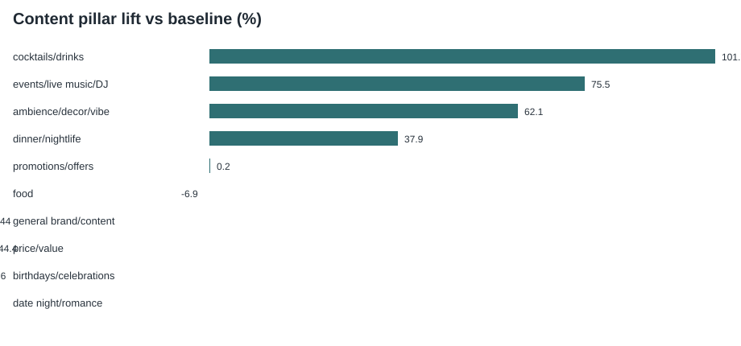
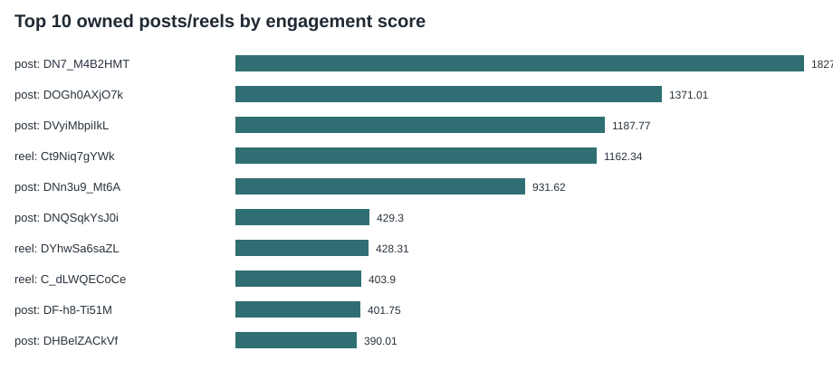
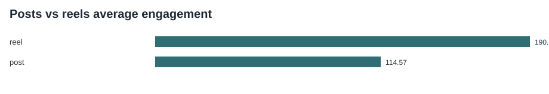
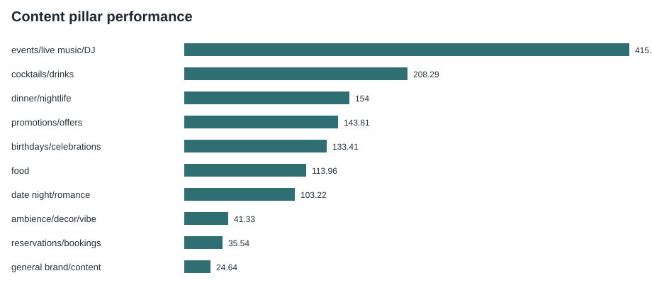
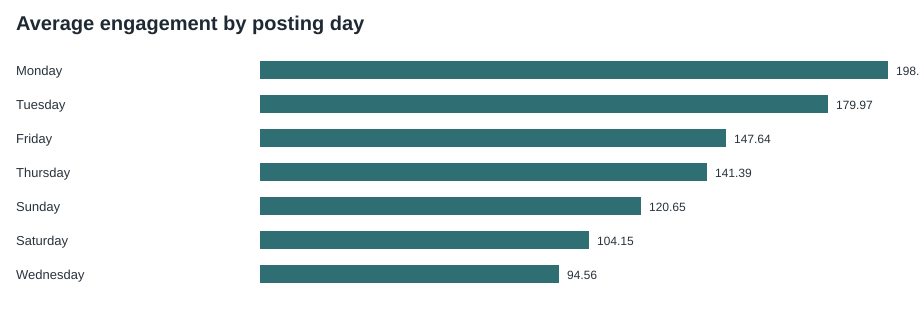
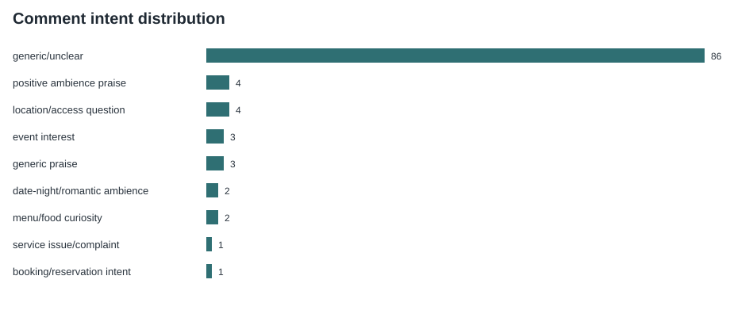

# Treehouse Ghana Instagram Intelligence Report

**Public engagement, audience intent, and content strategy analysis**

Prepared from public Instagram engagement data for Treehouse Ghana.

## Executive Summary

The public profile dataset shows 27,386 followers at collection time and includes 135 owned feed posts, 84 reels, 21 third-party mentions, and 106 comments from selected top posts.

This analysis adds a layer that Instagram native analytics does not usually provide in one place: cross-post public benchmarking, rule-based content pillar tagging, comment-intent classification, third-party mention review, and a client-ready view of what public audiences appear to respond to. Instagram native analytics remains essential for private metrics such as impressions, reach, saves, shares, profile visits, sticker taps, and link clicks.

Key findings:

- The strongest observed pillar by average engagement score is **cocktails/drinks**.
- The most common visible comment intent is **generic/unclear** (86 comments, 81.1% of classified comment signals).
- Owned content shows average engagement scores of 114.57 for posts and 190.2 for reels, based on public likes, comments, and available view/play counts.
- The comments dataset is small but commercially useful: it highlights questions and signals that can be converted into booking prompts, menu context, and clearer highlights.

## Data Coverage

| Area | Count |
| --- | ---: |
| Owned feed posts analysed | 135 |
| Reels analysed | 84 |
| Third-party mentions analysed | 21 |
| Comments analysed | 106 |
| Followers at collection time | 27386 |
| Instagram category | Not available |

Profile biography: Al fresco dining in the heart of Accra! Open daily from noon - 11pm!.

Data collection limitation: this is public Instagram data analysis. It does not include private account analytics such as reach, impressions, saves, shares, profile visits, link clicks, sticker taps, ad spend, or conversion events.

## Content Performance

Engagement score is calculated as: likes + (comments x 5) + (views or plays x 0.01). It is not a replacement for native analytics, but it is useful for comparing public posts where only partial public metrics are available.

## Advanced Statistical Layer

Instagram's dashboard is strongest for native account-owner metrics such as reach and impressions. This section adds a reproducible public-data layer that is harder to get from the dashboard: content lift, concentration, outlier detection, correlations, and bootstrap uncertainty estimates.

### Model-Style Findings

| Analysis | N | Metric | Estimate | CI Low | CI High | Interpretation |
| --- | --- | --- | --- | --- | --- | --- |
| posts_vs_reels_effect | 219 | engagement_score | 75.63 |  |  | Reels average 75.63 engagement-score points versus posts; Cohen's d 0.256. |
| engagement_concentration | 219 | top_10_share | 40.4 |  |  | The top 10 posts/reels account for 40.4% of public engagement score, indicating how concentrated performance is. |
| comments_per_selected_top_post | 106 | comment_volume | 4.24 |  |  | Average comments captured per selected high-performing post URL. |
| external_social_proof_ratio | 21 | mentions_per_100_owned_posts | 9.59 |  |  | Public third-party mentions per 100 owned posts/reels in the collected sample. |
| simple_regression_caption_length | 219 | caption_length | 0.0856 |  |  | Each one-unit increase in caption length is associated with 0.0856 engagement-score points in a simple public-metric model; R-squared 0.003. |
| simple_regression_hashtag_count | 219 | hashtag_count | 13.0716 |  |  | Each one-unit increase in hashtag count is associated with 13.0716 engagement-score points in a simple public-metric model; R-squared 0.015. |
| simple_regression_mention_count | 219 | mention_count | -2.2427 |  |  | Each one-unit increase in caption mention count is associated with -2.2427 engagement-score points in a simple public-metric model; R-squared 0. |
| simple_regression_views | 219 | views | 0.0165 |  |  | Each one-unit increase in views/plays is associated with 0.0165 engagement-score points in a simple public-metric model; R-squared 0.863. |
| bootstrap_mean_post | 135 | engagement_score | 114.57 | 76.17 | 157.4 | Bootstrap 95% confidence interval for average public engagement score for posts. |
| bootstrap_mean_reel | 84 | engagement_score | 190.2 | 126.31 | 265.8 | Bootstrap 95% confidence interval for average public engagement score for reels. |

Commercial reading:

- Reels show an estimated engagement-score difference of **75.63** points versus posts in the public dataset. This is directional, not causal, because content format is mixed with creative quality, topic, and timing.
- The top 10 owned posts/reels generate **40.4%** of total public engagement score. This concentration means a small number of creative patterns are carrying a large share of visible performance.
- Bootstrap confidence intervals are included to avoid overclaiming from small samples, especially at pillar level.

### Correlation Checks

| X | Y | Pearson r | Spearman rho | Interpretation |
| --- | --- | --- | --- | --- |
| caption_length | engagement_score | 0.055 | 0.305 | Correlation is directional and based only on public fields; it does not prove causation. |
| hashtag_count | engagement_score | 0.124 | 0.124 | Correlation is directional and based only on public fields; it does not prove causation. |
| mention_count | engagement_score | -0.02 | 0.346 | Correlation is directional and based only on public fields; it does not prove causation. |
| views | engagement_score | 0.929 | 0.717 | Correlation is directional and based only on public fields; it does not prove causation. |
| likes | comments | 0.406 | 0.36 | Correlation is directional and based only on public fields; it does not prove causation. |

### Pillar Lift vs Baseline

| Pillar | N | Avg Engagement | Lift vs Baseline | Top-20 Hit Rate | 95% CI |
| --- | --- | --- | --- | --- | --- |
| cocktails/drinks | 11 | 289.59 | 101.7% | 27.3% | 56.86 to 532.39 |
| events/live music/DJ | 8 | 251.93 | 75.5% | 25% | 66.95 to 555.72 |
| ambience/decor/vibe | 15 | 232.75 | 62.1% | 40% | 108.68 to 388.09 |
| dinner/nightlife | 17 | 197.94 | 37.9% | 35.3% | 54.72 to 393.07 |
| promotions/offers | 2 | 143.81 | 0.2% | 100% | 143.81 to 143.81 |
| food | 111 | 133.73 | -6.9% | 15.3% | 82.43 to 188.53 |
| general brand/content | 33 | 80.36 | -44% | 15.2% | 42.65 to 128.02 |
| price/value | 2 | 79.84 | -44.4% | 0% | 79.84 to 79.84 |
| birthdays/celebrations | 6 | 76.73 | -46.6% | 0% | 43.99 to 109.47 |
| date night/romance | 12 | 76.07 | -47% | 25% | 39.98 to 120.85 |
| reservations/bookings | 2 | 35.54 | -75.2% | 0% | 35.54 to 35.54 |

### Public Engagement Outliers

| Type | URL | Pillar | Engagement | Likes | Comments | Views/Plays |
| --- | --- | --- | --- | --- | --- | --- |
| post | [Instagram post](https://www.instagram.com/p/DN7_M4B2HMT/) | food | 1827.76 | 951 | 5 | 85176 |
| reel | [Instagram post](https://www.instagram.com/p/DN7_M4B2HMT/) | food | 1827.76 | 951 | 5 | 85176 |
| post | [Instagram post](https://www.instagram.com/p/DOGh0AXjO7k/) | food | 1371.01 | 311 | 1 | 105501 |
| reel | [Instagram post](https://www.instagram.com/p/DOGh0AXjO7k/) | food | 1371.01 | 311 | 1 | 105501 |
| post | [Instagram post](https://www.instagram.com/p/DVyiMbpiIkL/) | dinner/nightlife | 1187.77 | 421 | 3 | 75177 |
| reel | [Instagram post](https://www.instagram.com/p/DVyiMbpiIkL/) | dinner/nightlife | 1187.77 | 421 | 3 | 75177 |
| reel | [Instagram post](https://www.instagram.com/p/Ct9Niq7gYWk/) | events/live music/DJ | 1162.34 | 488 | 1 | 66934 |
| post | [Instagram post](https://www.instagram.com/p/DNn3u9_Mt6A/) | cocktails/drinks | 931.62 | 472 | 0 | 45962 |
| reel | [Instagram post](https://www.instagram.com/p/DNn3u9_Mt6A/) | cocktails/drinks | 931.62 | 472 | 0 | 45962 |
| reel | [Instagram post](https://www.instagram.com/p/DQUsBoXEVxU/) | cocktails/drinks | 919.57 | 304 | 29 | 47057 |
| post | [Instagram post](https://www.instagram.com/p/DLAi1YBsAZs/) | ambience/decor/vibe | 878.28 | 433 | 58 | 15528 |
| reel | [Instagram post](https://www.instagram.com/p/DLAi1YBsAZs/) | ambience/decor/vibe | 878.28 | 433 | 58 | 15528 |

Outliers are useful because they show creative patterns that break away from normal performance. They should be reviewed qualitatively before turning them into repeatable templates.

### Top Posts by Likes

| URL | Likes | Comments | Views/Plays | Pillar |
| --- | --- | --- | --- | --- |
| [Instagram post](https://www.instagram.com/p/DN7_M4B2HMT/) | 951 | 5 | 85176 | food |
| [Instagram post](https://www.instagram.com/p/DTYWwIHjCIw/) | 600 | 16 | 0 | general brand/content |
| [Instagram post](https://www.instagram.com/p/DNn3u9_Mt6A/) | 472 | 0 | 45962 | cocktails/drinks |
| [Instagram post](https://www.instagram.com/p/DLAi1YBsAZs/) | 433 | 58 | 15528 | ambience/decor/vibe |
| [Instagram post](https://www.instagram.com/p/DVyiMbpiIkL/) | 421 | 3 | 75177 | dinner/nightlife |
| [Instagram post](https://www.instagram.com/p/DOGh0AXjO7k/) | 311 | 1 | 105501 | food |
| [Instagram post](https://www.instagram.com/p/DTWDF4zjZeL/) | 250 | 34 | 4272 | ambience/decor/vibe |
| [Instagram post](https://www.instagram.com/p/DHBelZACkVf/) | 240 | 0 | 15001 | food |
| [Instagram post](https://www.instagram.com/p/DNQSqkYsJ0i/) | 209 | 6 | 19030 | food |
| [Instagram post](https://www.instagram.com/p/DKnAl-vOeT_/) | 193 | 11 | 0 | general brand/content |

### Top Posts by Comments

| URL | Comments | Likes | Engagement Score | Pillar |
| --- | --- | --- | --- | --- |
| [Instagram post](https://www.instagram.com/p/DLAi1YBsAZs/) | 58 | 433 | 878.28 | ambience/decor/vibe |
| [Instagram post](https://www.instagram.com/p/DTWDF4zjZeL/) | 34 | 250 | 462.72 | ambience/decor/vibe |
| [Instagram post](https://www.instagram.com/p/DTYWwIHjCIw/) | 16 | 600 | 680 | general brand/content |
| [Instagram post](https://www.instagram.com/p/DEFdW_5o6wY/) | 16 | 160 | 289.97 | general brand/content |
| [Instagram post](https://www.instagram.com/p/DMDODdDIl7R/) | 13 | 114 | 241.96 | ambience/decor/vibe |
| [Instagram post](https://www.instagram.com/p/DTmIxc1CFcO/) | 12 | 64 | 137.67 | dinner/nightlife |
| [Instagram post](https://www.instagram.com/p/DKnAl-vOeT_/) | 11 | 193 | 248 | general brand/content |
| [Instagram post](https://www.instagram.com/p/DEpW09ANUHN/) | 10 | -1 | 114.1 | food |
| [Instagram post](https://www.instagram.com/p/DTg9vFniCRV/) | 6 | 67 | 97 | general brand/content |
| [Instagram post](https://www.instagram.com/p/DTWGdLaDbnP/) | 6 | 74 | 127.51 | events/live music/DJ |

### Top Reels by Views/Plays

| URL | Views/Plays | Likes | Comments | Engagement Score |
| --- | --- | --- | --- | --- |
| [Instagram post](https://www.instagram.com/p/DOGh0AXjO7k/) | 105501 | 311 | 1 | 1371.01 |
| [Instagram post](https://www.instagram.com/p/DN7_M4B2HMT/) | 85176 | 951 | 5 | 1827.76 |
| [Instagram post](https://www.instagram.com/p/DVyiMbpiIkL/) | 75177 | 421 | 3 | 1187.77 |
| [Instagram post](https://www.instagram.com/p/Ct9Niq7gYWk/) | 66934 | 488 | 1 | 1162.34 |
| [Instagram post](https://www.instagram.com/p/DQUsBoXEVxU/) | 47057 | 304 | 29 | 919.57 |
| [Instagram post](https://www.instagram.com/p/DNn3u9_Mt6A/) | 45962 | 472 | 0 | 931.62 |
| [Instagram post](https://www.instagram.com/p/DYhwSa6saZL/) | 29331 | 135 | 0 | 428.31 |
| [Instagram post](https://www.instagram.com/p/DF-h8-Ti51M/) | 21475 | 182 | 1 | 401.75 |
| [Instagram post](https://www.instagram.com/p/DDkPBcmqTGz/) | 21067 | -1 | 15 | 284.67 |
| [Instagram post](https://www.instagram.com/p/DNQSqkYsJ0i/) | 19030 | 209 | 6 | 429.3 |

## Posts vs Reels

| Content Type | Count | Avg Engagement Score | Avg Views/Plays |
| --- | --- | --- | --- |
| reel | 84 | 190.2 | 8999.05 |
| post | 135 | 114.57 | 4302.98 |

Interpretation: reels should be treated as reach and discovery assets, while feed posts and carousels can carry more detailed menu, reservation, and occasion messaging. Where reels have public plays but lower comment depth, captions and pinned comments should make the next action clearer.

## Content Pillars

| Pillar | Posts | Avg Likes | Avg Comments | Avg Views | Engagement | Strong Example |
| --- | --- | --- | --- | --- | --- | --- |
| cocktails/drinks | 11 | 132 | 2.91 | 14304.27 | 289.59 | [Instagram post](https://www.instagram.com/p/DNn3u9_Mt6A/) |
| events/live music/DJ | 8 | 121.75 | 2.38 | 11830.25 | 251.93 | [Instagram post](https://www.instagram.com/p/Ct9Niq7gYWk/) |
| ambience/decor/vibe | 15 | 123.07 | 14.2 | 3868.6 | 232.75 | [Instagram post](https://www.instagram.com/p/DLAi1YBsAZs/) |
| dinner/nightlife | 17 | 86.71 | 2.06 | 10094.12 | 197.94 | [Instagram post](https://www.instagram.com/p/DVyiMbpiIkL/) |
| promotions/offers | 2 | 72 | 1 | 6681 | 143.81 | [Instagram post](https://www.instagram.com/p/DTH5haVDIMh/) |
| food | 111 | 61.42 | 0.98 | 6739.22 | 133.73 | [Instagram post](https://www.instagram.com/p/DN7_M4B2HMT/) |
| general brand/content | 33 | 57.15 | 2.79 | 926.94 | 80.36 | [Instagram post](https://www.instagram.com/p/DTYWwIHjCIw/) |
| price/value | 2 | 54 | 1 | 2084 | 79.84 | [Instagram post](https://www.instagram.com/p/DYPsWk5tSgG/) |
| birthdays/celebrations | 6 | 31.67 | 0.33 | 4339.67 | 76.73 | [Instagram post](https://www.instagram.com/p/DJJoEtFCxh_/) |
| date night/romance | 12 | 49.25 | 0.42 | 2473.83 | 76.07 | [Instagram post](https://www.instagram.com/p/CzWcDSpMoh9/) |
| reservations/bookings | 2 | 19 | 0 | 1654 | 35.54 | [Instagram post](https://www.instagram.com/p/DIjAIJSCNB3/) |

Business interpretation:

- **cocktails/drinks**: Drinks content can support nightlife, after-work, and group-visit occasions.
- **events/live music/DJ**: Event content needs clear dates, artists, times, and booking instructions.
- **ambience/decor/vibe**: Vibe-led content sells the venue experience and should be paired with reservation details.
- **dinner/nightlife**: Evening content should highlight atmosphere, availability, and weekly rituals.
- **promotions/offers**: Offers should be tested with clear expiry dates and measurable response prompts.
- **food**: Use appetising food visuals with direct menu and booking prompts.
- **general brand/content**: General brand content; use stronger occasion, menu, or booking cues.
- **price/value**: Price questions can be reduced with menu previews and package framing.

## Caption and Hashtag Analysis

| Metric | Value |
| --- | ---: |
| Average caption length | 192.7 characters |
| Median caption length | 151 characters |
| Average hashtags per post/reel | 3.69 |
| Average mentions per post/reel | 1.24 |
| Short caption avg engagement | 131.96 |
| Medium caption avg engagement | 141.24 |
| Long caption avg engagement | 175.51 |

Most frequent hashtags:

| Hashtag | Count |
| --- | --- |
| #treehouserestaurant | 111 |
| #reels | 54 |
| #dinner | 47 |
| #goodfood | 42 |
| #explore | 35 |
| #lunch | 21 |
| #soulmusic | 19 |
| #food | 19 |
| #afroson1cx | 14 |
| #livemusic | 12 |
| #treehouse | 11 |
| #afx2026 | 10 |
| #foodinsta | 10 |
| #dinnertime | 10 |
| #soulfriday | 10 |

Best-performing caption patterns are likely to combine one clear occasion cue, one sensory proof point, and one practical next step. For Treehouse Ghana, this means captions should not only describe the vibe; they should tell the reader when to come, what to try, and how to reserve.

## Timing Analysis

| Type | Period | Posts/Reels | Avg Engagement | Avg Likes | Avg Comments |
| --- | --- | --- | --- | --- | --- |
| day_of_week | Monday | 20 | 198.86 | 99.15 | 1.9 |
| day_of_week | Tuesday | 43 | 179.97 | 75.14 | 3.33 |
| day_of_week | Friday | 47 | 147.64 | 77.53 | 1.55 |
| day_of_week | Thursday | 38 | 141.39 | 62.39 | 0.74 |
| day_of_week | Sunday | 17 | 120.65 | 79.94 | 3.41 |
| day_of_week | Saturday | 27 | 104.15 | 53.44 | 5.56 |
| day_of_week | Wednesday | 27 | 94.56 | 55.19 | 0.78 |
| hour_utc | Unknown | 3 | 44.85 | 15.67 | 2 |
| hour_utc | 2 | 1 | 97 | 67 | 6 |
| hour_utc | 3 | 6 | 62.78 | 27.67 | 5.33 |
| hour_utc | 4 | 2 | 31.5 | 29 | 0.5 |
| hour_utc | 7 | 2 | 80.73 | 64 | 1 |
| hour_utc | 8 | 2 | 61.58 | -1 | 0 |
| hour_utc | 9 | 8 | 61.96 | 26.5 | 0.75 |
| hour_utc | 10 | 3 | 79.84 | 13.67 | 4.33 |
| hour_utc | 11 | 5 | 765.42 | 408.6 | 2.8 |
| hour_utc | 12 | 69 | 58.93 | 35.87 | 0.38 |
| hour_utc | 13 | 21 | 232.02 | 82.48 | 2.71 |
| hour_utc | 14 | 8 | 232.27 | 113 | 4.13 |
| hour_utc | 15 | 34 | 161.25 | 76.59 | 0.79 |
| hour_utc | 16 | 21 | 245.74 | 118.95 | 5.81 |
| hour_utc | 17 | 6 | 69.61 | 21.17 | 2.67 |
| hour_utc | 18 | 9 | 249.87 | 158.44 | 7 |
| hour_utc | 19 | 5 | 32.82 | 7 | 0.2 |
| hour_utc | 20 | 6 | 65.08 | 45 | 1 |
| hour_utc | 21 | 6 | 208.15 | 115.33 | 13.33 |
| hour_utc | 22 | 2 | 8.06 | -1 | 0 |

Suggested timing windows:

- Food posts: prioritise Monday, Tuesday, Friday around 11:00 UTC, 18:00 UTC, 16:00 UTC and test consistently for four weeks.
- Ambience posts: prioritise Monday, Tuesday, Friday around 11:00 UTC, 18:00 UTC, 16:00 UTC and test consistently for four weeks.
- Event posts: prioritise Monday, Tuesday, Friday around 11:00 UTC, 18:00 UTC, 16:00 UTC and test consistently for four weeks.
- Booking-intent posts: prioritise Monday, Tuesday, Friday around 11:00 UTC, 18:00 UTC, 16:00 UTC and test consistently for four weeks.

These windows should be treated as test windows because public post timing does not include reach or follower-online data.

## Comment Intelligence

The comment review uses anonymised text only. Usernames are excluded from the processed report outputs because the commercial value is in the repeated questions and intent signals, not individual identities.

| Intent Theme | Count | Percent | Anonymised Example | Commercial Opportunity |
| --- | --- | --- | --- | --- |
| generic/unclear | 86 | 81.1% | How do i get the pictures | Useful brand warmth, but convert with clearer next steps. |
| generic praise | 8 | 7.5% | you look and sound amazing ❤️ | Useful brand warmth, but convert with clearer next steps. |
| positive ambience praise | 5 | 4.7% | Beautiful | Use ambience comments as proof for venue positioning. |
| location/access question | 5 | 4.7% | Location? | Pin address, parking, map, and arrival guidance in captions and highlights. |
| event interest | 3 | 2.8% | @enid_blekk on guitar 🎸 @niiamateycongas_ on percussion @musical_jerry_ on saxophone🎷 ✨✨✨✨✨✨✨ | Create event posts with dates, times, line-up, and reservation CTA. |
| date-night/romantic ambience | 3 | 2.8% | Love this! 🔥❤️ | Package ambience-led content around date-night reservations. |
| menu/food curiosity | 2 | 1.9% | You are phenomenal too. Your shots are great | Use captions and carousel slides to answer menu questions before users ask. |
| service issue/complaint | 1 | 0.9% | Not long now! Can’t wait!! 🙌 | Track and resolve operational issues privately; avoid letting concerns sit unanswered. |
| price/value concern | 1 | 0.9% | PROPERTY FOR SALE Property Highlights • Spacious living & dining area • 4 en-suite bedrooms with fitted cabinets • Fully | Add menu ranges, bundles, or occasion packages where commercially appropriate. |
| booking/reservation intent | 1 | 0.9% | @followers 2025 DETTY DECEMBER IN GHANA _Afrofure🇬🇭🇬🇭🇬🇭27TH DECE,2025-3TH JAN,2026. We can tailor your itinerary t | Reply quickly with booking link or WhatsApp prompt and save FAQs to highlights. |

Repeated opportunities:

- Turn booking-related comments into faster conversion by using pinned comments, WhatsApp prompts, and caption CTAs.
- Move repeated questions about menus, pricing, location, parking, and event timing into highlights.
- Reuse positive food, ambience, and cocktail praise as anonymised social proof in stories and captions.

## Mentions Intelligence

Third-party mentions are external social proof. The mentions dataset contains 21 public records and should be reviewed as a source of customer language, creator-led positioning, and visual proof. When mention captions overlap with strong owned-content pillars, Treehouse can repost them with added booking context.

Compared with owned posts, mentions are usually less controllable but often more credible. The practical use is to identify which customer moments people choose to share without being prompted: food, ambience, celebrations, nightlife, and group experiences.

## Strategic Recommendations

1. Post more of the strongest occasion-led pillars, especially cocktails/drinks, events/live music/DJ, ambience/decor/vibe.
2. Use reels as discovery assets: short food reveals, ambience walk-throughs, event teasers, and customer-proof clips should each include a booking CTA.
3. Convert comments into reservations by replying with a consistent booking path and pinning the most useful response.
4. Build FAQ highlights for menu, location, parking/access, birthday bookings, event nights, and reservation process.
5. Make captions more commercially complete: occasion cue, product or experience cue, date/time where relevant, and booking instruction.
6. Repost third-party mentions selectively and add context that the original post may not include.
7. Track content pillars monthly so the team knows whether food, ambience, events, or celebrations are driving the strongest public response.

## Four-Week Content Calendar

| Week | Focus | Suggested Content |
| --- | --- | --- |
| Week 1 | Food and menu confidence | 2 food reels, 1 carousel with signature dishes, 1 story poll asking what guests want to try |
| Week 2 | Ambience and date night | 2 ambience reels, 1 date-night post, 1 booking reminder story sequence |
| Week 3 | Events and nightlife | 1 DJ/live music teaser, 1 event recap reel, 1 caption with date/time/reservation details |
| Week 4 | Social proof and celebrations | 2 reposts/UGC stories, 1 birthday or group booking post, 1 FAQ highlight refresh |

## Suggested Monthly KPIs

- Public engagement score by pillar
- Reels plays/views and completion proxies where available in native analytics
- Comment volume and booking-intent comment count
- Reservation CTA clicks or WhatsApp enquiries from Instagram
- Story sticker taps, link clicks, and profile actions from Instagram native analytics
- Number of customer mentions reused as social proof
- Response time to commercial comments and DMs

## Limitations and Ethics

This report is based on public Instagram data collected through Apify and analysed locally. Results depend on what was publicly available at collection time. Instagram does not expose all private analytics through this public data, including impressions, reach, saves, shares, profile visits, link clicks, DM volume, ad targeting, or completed bookings.

The conclusions are directional rather than absolute. No private account access was used, no private user data was used, and individual commenters are not identified in the report. For business decisions, combine this analysis with Treehouse Ghana's native Instagram analytics, reservation data, point-of-sale trends, and campaign context.
